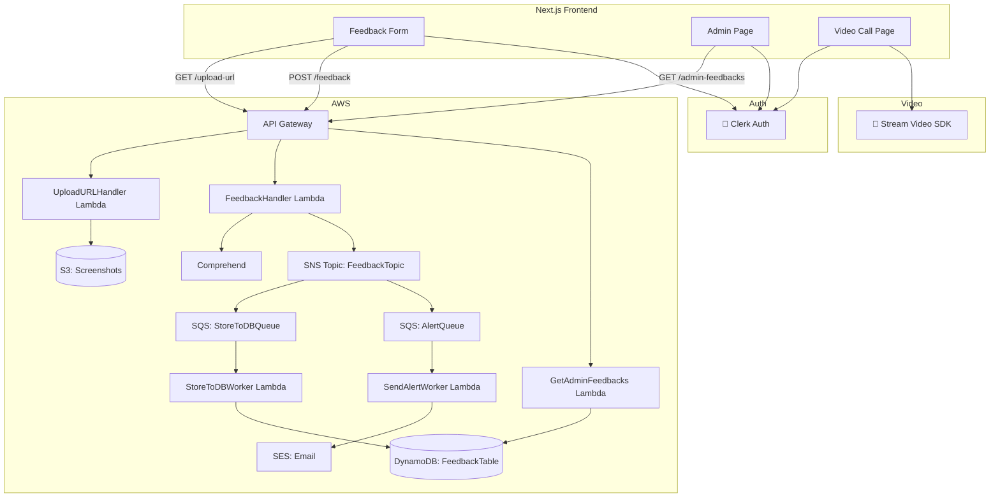

# 📣 Serverless Feedback Analyzer System

This project is a full-stack **serverless feedback management system** built using AWS services, Next.js (React), Tailwind, Clerk for auth, and Stream SDK for video calling. It allows users to submit feedback (with screenshots), analyzes sentiment using Amazon Comprehend, and routes data through a scalable, event-driven architecture.


---

## 📌 Features

- ✍️ Feedback form with optional screenshot upload
- 📤 Screenshot stored securely in Amazon S3
- 🧠 Sentiment analysis + key phrase extraction using Amazon Comprehend
- 📩 Negative feedback alerts via Amazon SES
- 🗃 Feedback storage in DynamoDB
- 🔐 Admin dashboard secured with Clerk
- 🎥 Video calling enabled via Stream Video SDK
- ✅ Fully serverless, event-driven architecture with Lambda, SNS, SQS
- 📹 Video call recording and custom controls (mute, camera, screen share)

---

## 🧠 High-Level Architecture (HLD)



---

## 🏗 Tech Stack

### Frontend:
- Next.js + React + Tailwind CSS
- Clerk (Auth)
- Stream Video SDK (Video calling)
- ShadCN UI (toasts & components)

### Backend:
- AWS Lambda
- Amazon API Gateway
- Amazon DynamoDB
- Amazon S3
- Amazon SNS + SQS
- Amazon SES (for email)
- Amazon Comprehend (for sentiment)

---

## 🔐 Authentication & Video Integration

### Clerk (User Authentication)
The app uses **Clerk** to handle authentication. Users must sign in to submit feedback or access the admin panel. Clerk manages sessions and provides JWT tokens used to secure API calls.

### Stream Video SDK (Video Conferencing)
Users can initiate or join video calls using **Stream Video SDK**, providing a high-quality WebRTC-based communication layer integrated directly into the frontend.

---

## 🎥 Stream Video SDK Features

- **Recording Enabled**: Users can record video calls (configured via Stream backend).
- **Custom Call Controls**:
  - Mute/Unmute mic
  - Enable/Disable camera
  - Leave button
  - Screen sharing
- **Participant View Customization**:
  - Admins can view participant layout
  - Grid and speaker view support

---

## 📦 Project Structure (Lambda)

```
lambdas/
├── UploadURLHandler.mjs
├── FeedbackHandler.mjs
├── StoreToDBWorker.mjs
├── SendAlertWorker.mjs
└── GetAdminFeedbacks.mjs
```

---

## 🖥️ Admin Dashboard

- Displays feedback text, sentiment, timestamp, and screenshot preview.
- Auto-updated via API call to `GET /admin-feedbacks`.

---

## 🚀 Deployment Steps

1. Deploy Lambdas via AWS Console or CDK.
2. Create DynamoDB table: `FeedbackTable`
3. Create S3 Bucket: `video-feedback-screenshots`
4. Set up SNS topic and two SQS queues.
5. Connect frontend with Clerk + Stream.
6. Deploy frontend on Vercel or Netlify.

---

## 📬 Feedback Flow Summary

1. User submits feedback
2. Lambda runs sentiment & key phrase analysis
3. SNS fanout:
   - One queue stores feedback into DynamoDB
   - One queue triggers SES email on negative sentiment
4. Admin dashboard fetches all feedbacks (with screenshots)

---

## 🌐 Live Demo

🔗 [Try the App Here](https://video-conferencing-app-eight.vercel.app)

---

## 📄 License

This project is licensed under the MIT License.

---

## 🙌 Author

Built by Passionate Devops Engineer.
