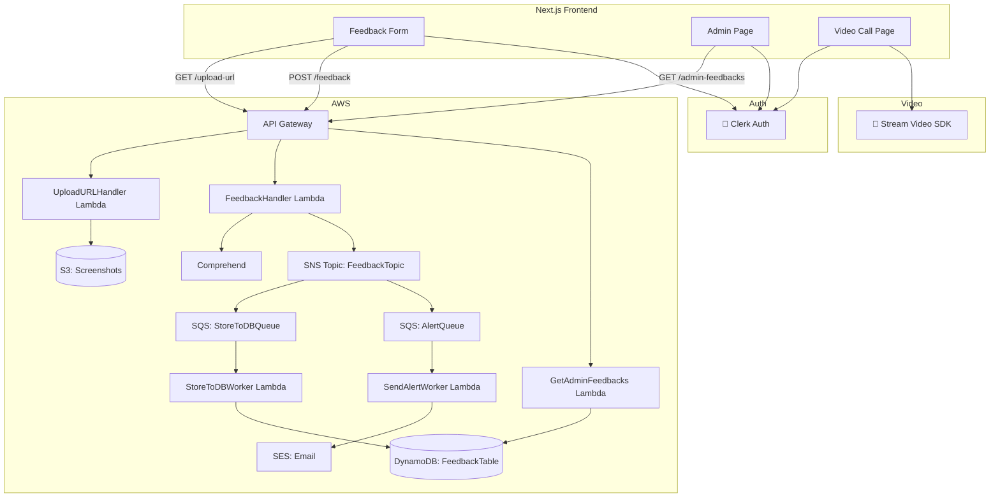

# 📣 Serverless Feedback Analyzer System

This project is a full-stack **serverless feedback management system** built using AWS services, Next.js (React), Tailwind, Clerk for auth, and Stream SDK for video calling. It allows users to submit feedback (with screenshots), analyzes sentiment using Amazon Comprehend, and routes data through a scalable, event-driven architecture.

---

## 📌 Features

- ✍️ Feedback form with optional screenshot upload
- 📤 Screenshot stored securely in Amazon S3
- 🧠 Sentiment analysis + key phrase extraction using Amazon Comprehend
- 📩 Negative feedback alerts via Amazon SES
- 🗃 Feedback storage in DynamoDB
- 🔐 Admin dashboard secured with Clerk
- 🎥 Video calling enabled via Stream Video SDK
- ✅ Fully serverless, event-driven architecture with Lambda, SNS, SQS

---

## 🧠 High-Level Architecture (HLD)



---

## 🏗 Tech Stack

### Frontend:
- Next.js + React + Tailwind CSS
- Clerk (Auth)
- Stream Video SDK (Video calling)
- ShadCN UI (toasts & components)

### Backend:
- AWS Lambda
- Amazon API Gateway
- Amazon DynamoDB
- Amazon S3
- Amazon SNS + SQS
- Amazon SES (for email)
- Amazon Comprehend (for sentiment)

---

## 📦 Folder Structure

```
.
├── frontend/
│   ├── pages/
│   │   ├── index.jsx
│   │   ├── admin.jsx
│   │   └── video.jsx
│   ├── components/
│   ├── utils/
│   └── styles/
├── lambdas/
│   ├── UploadURLHandler.js
│   ├── FeedbackHandler.js
│   ├── StoreToDBWorker.js
│   ├── SendAlertWorker.js
│   └── GetAdminFeedbacks.js
├── infra/
│   └── (SAM / Terraform templates if used)
├── README.md
```

---

## 🛠 Setup Instructions

### 1. 🧾 Prerequisites

- AWS Account
- Node.js v18+ (or AWS Lambda compatible version)
- Clerk project (get API keys from https://clerk.dev)
- Stream project (get video keys from https://getstream.io)

---

### 2. 🔐 Setup Clerk Auth

- Add Clerk provider in `_app.jsx`
- Protect routes like `/admin` using `useAuth()` and `RedirectToSignIn`

---

### 3. ☁️ Deploy Backend

You can deploy the Lambda functions using AWS Console (via zip), or automate using AWS SAM or Terraform.

Example:
```bash
zip -r FeedbackHandler.zip .
aws lambda update-function-code   --function-name FeedbackHandler   --zip-file fileb://FeedbackHandler.zip
```

---

### 4. 🚀 Run Frontend Locally

```bash
cd frontend
npm install
npm run dev
```

- Visit `http://localhost:3000` to see the app.
- Admin route: `/admin`
- Video call route: `/video`

---

## 📸 Screenshot Example

| Feedback with Screenshot | Admin Dashboard |
|--------------------------|-----------------|
|  |  |

---

## 📬 Feedback Flow Summary

1. User submits feedback
2. Lambda runs sentiment & key phrase analysis
3. SNS fanout:
   - One queue stores feedback into DynamoDB
   - One queue triggers SES email on negative sentiment
4. Admin dashboard fetches all feedbacks (with screenshots)

---

## 🧪 Testing

Use Postman or `curl`:
```bash
curl -X POST https://<api>/feedback   -H "Content-Type: application/json"   -d '{"feedbackText":"Service was slow", "screenshotKey":"screenshot.png"}'
```

---

## 🧾 License

MIT © [Your Name]